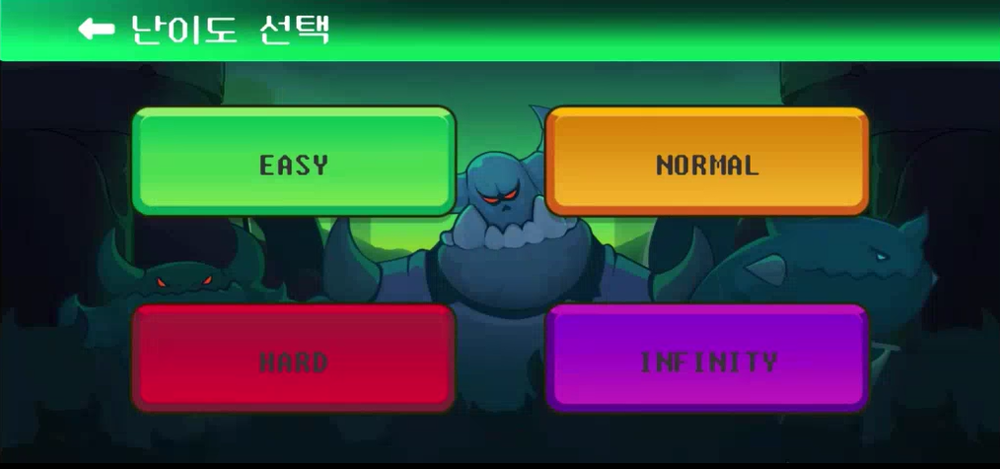

# Tactical Tower Defense

> 타워디펜스에 Auto Chess 장르를 오마주하여 배치된 타워들을 합쳐서 성장시킬 수 있는 게임.

## 1️⃣ 프로젝트 개요

### 개발 기간
개발기간 2023.10.10 ~ 2023.11.17 (6주)

### MG(Mobile Game) 세대 팀

- 김민식 : 팀장, 기획 및 밸런스, 캐릭터 디자인, 시너지 로직 구현, QA
- 강동혁 : 회원관리, DB관리, 랭킹 시스템, 맵 디자인, 사운드 구성
- 차영범 : 게임 로직 구현, 게임 UI 구현
- 노윤식 : 배포 웹 페이지 구현, QA
- 김효인 : 배포 웹 페이지 구현, QA
- 이준혁 : Infra

### 기획 의도

- 현재 모바일 게임의 시장성을 분석하고 실제 회사에서 가장 많이 이익을 낼 수 있는 게임을 생각하였음.
- 수익성 : 구글플레이, 애플스토어의 인기 게임 Top 50을 조사하여 수익성이 좋은 장르를 선택하여 현업에서 추구하는 이익을 낼 수 있는 게임을 제작한다.
    - https://www.yna.co.kr/view/AKR20231011116800017
    - 현재 모바일 게임 시장은 MMO RPG 뿐 아니라 작고 캐주얼한 게임 역시 강세
    - 작고 캐주얼한 게임 가운데 IP의 제약이 없는 장르를 선정하고자 함
- 싱글게임
    - https://www.hankyung.com/article/202310119534Y
    - 세계 게임 이용자의 49%는 싱글 게임을 이용(멀티게임이 시장성 측면에서 명확한 장점이 존재하지 않음)

### 목표

- 지금의 모바일 시장을 분석하고 게임성과 수익성을 강조한 게임을 제작하는 것을 목표로 하였음.

## 2️⃣ 게임 소개

### 게임 설명

- 각 웨이브 별로 몬스터가 몰려오고, 이를 배치된 타워(캐릭터)로 막아내는 게임이다.
- 시스템의 일부는 AutoChess 장르에서 밴치마킹하여 사용하였다.
  - 동일 캐릭터 3개가 모이면 등급 상승
  - 랜덤으로 캐릭터를 구매할 수 있음
  - 일정확률로 아이템을 얻을 수 있고, 조합 시스템도 구현되어 있음
  - 캐릭터 별로 시너지가 존재하여 시너지 등급을 맞추면 다양한 능력을 발휘
- 랭킹 시스템을 구현하여 유저별로 경쟁을 할 수 있도록 유도
- 한 게임을 짧게 진행함으로서 다회차 플레이를 유도함

### 게임 화면

**메인페이지**   

**회원가입**   

**로그인**   

**로그인 후 페이지**   

**튜토리얼페이지**   

**랭킹페이지**   

**난이도설정**   

**게임시작**   
  

**상점**   

**인벤토리**   

**아이템 및 캐릭터 정보 확인**      

**시너지 정보 확인**   

**아이템 부여 및 조합**   

**보스웨이브**   

**게임오버**   

**게임클리어**   

## 3️⃣ **개발 환경**

### ⚙ Management Tool
- 형상 관리 : Gitlab, Plastic SCM
- 이슈 관리 : Jira
- 커뮤니케이션 : Mattermost, Notion
- 디자인 : Unity, 자체 CSS & picture

### 💻 IDE
- Visual Studio 2022
- Visual Studio Code

### 📱 Client
- Unity `2021.3.31f1`

### 📁 Frontend
- React `18.2.0`
- typescript
- firebase `10.5.2`
- react-dom `18.2.0`
- react-player `2.13.0`
- react-router-dom `6.18.0`
- react-scripts `5.0.1`
- styled-components `6.1.0`
- styled-reset `4.5.1`

### 💾 Database
- Realtime Firebase

### 🌁 Infra
- Jenkins 2.401.3
- docker-compose
- SSL
- Nginx

### 🎞 Storage
- Amazon EC2(Ubuntu 20.04)

## 4️⃣**설계 문서**

### 🎨 [와이어프레임](https://glacier-eagle-e13.notion.site/79f7177cd39e4b3293fcf8285aac7ad8?pvs=4)

### [📃 요구사항 정의서](https://glacier-eagle-e13.notion.site/3149b6b22d8c485ea8c48b59846c49d3?v=d2eadeb657304a408a2781d74b0adc8d&pvs=4)

### [📝 밸런스 패치 노트](./TTD_Frontend/ttd/src/patchnotes/patchnotes.json)

### [📏 ERD](./exec/readmeimg/FirebaseRule.PNG)

### [📐 시스템 아키텍처](./exec/readmeimg/SyetemArchitecture.PNG)

### [💰 버그 리포트](https://glacier-eagle-e13.notion.site/2d8d084361ca4c92ae9cbbbcdba4e1a4?pvs=4)
